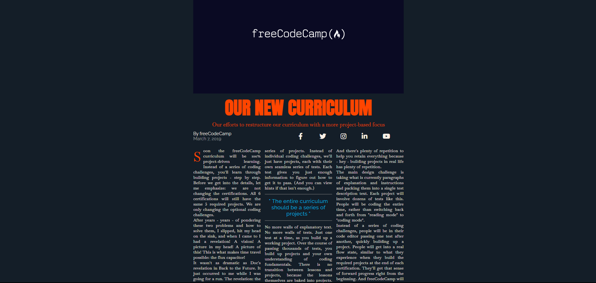

# 📰 Magazine
​
Welcome to the **Magazine** repository! This project consists of a modern and responsive magazine website, developed with **HTML5** and **CSS3**. The goal is to practice the creation of elegant and adaptable layouts, fundamental for the construction of informative and visually pleasing web pages.​

## Layout

    

## 📋 Features

- **Magazine Layout:** Presents a typical magazine structure, with well-defined sections and highlighting of main content.

- **Responsive Design:** Adapts to different screen sizes, ensuring a good experience on mobile devices and desktops.

- **Modern Style:** Uses a soft color palette and legible typography to facilitate reading and navigation.​

## 🛠️ Technologies Used

- **HTML5:** Semantic structuring of the page content.

- **CSS3:** Responsive styling and layout of the website.